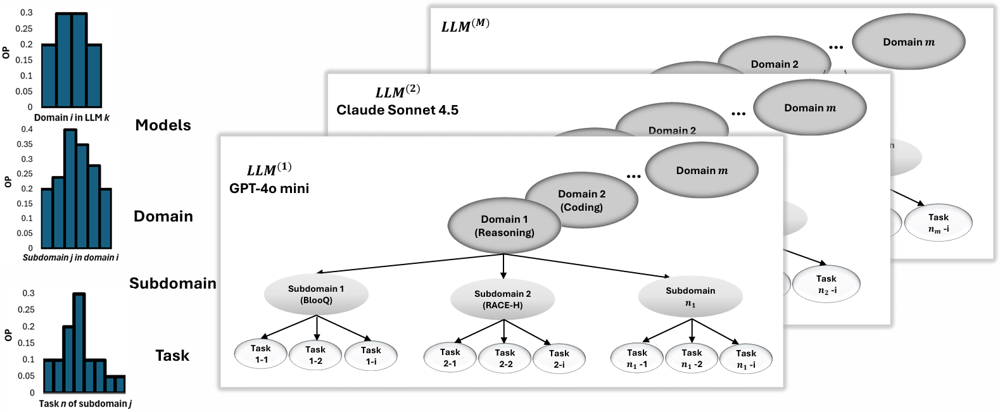

# HIP-LLM: A Hierarchical Imprecise Probability Approach to Reliability Assessment of Large Language Models

A tiny, reproducible bundle of **numerics** used in all figures of the paper (imprecise hierarchical Bayes over LLM accuracies).

📄 **Paper**: [arXiv](link-when-available) | [PDF](link-when-available)

---

## 📑 Table of Contents
- [Quick Start](#quick-start)
- [Authors](#-authors)
- [Overview](#-overview)
- [Abstract](#-abstract)
- [Visualizations](#-visualizations)

---

## Quick Start

Clone the repo and install the tiny runtime dependencies:

```bash
git clone https://github.com/aghazadehchakherlou-web/llm-imprecise-bayes.git
cd llm-imprecise-bayes
pip install -r requirements.txt
```

---

## 👥 Authors

- [Robab Aghazadeh Chakherlou](https://scholar.google.co.uk/citations?hl=en&user=hfn5eFMAAAAJ)
- [Qing Guo](https://scholar.google.co.uk/citations?hl=en&user=joK9NAoAAAAJ)
- [Siddartha Khastgir](https://scholar.google.co.uk/citations?hl=en&user=r3ldU6sAAAAJ)
- [Peter Popov](https://scholar.google.co.uk/citations?hl=en&user=ZraM0uwAAAAJ)
- [Xiaoge Zhang](https://scholar.google.co.uk/citations?hl=en&user=USCW004AAAAJ)
- [Xingyu Zhao](https://scholar.google.co.uk/citations?hl=en&user=SzEBdA8AAAAJ)

---

## 🌐 Overview

### General Structure
<p align="center">
  
</p>

### Hierarchical Bayesian Model
<p align="center">
 
</p>

---

## 📝 Abstract

Large Language Models (LLMs) are increasingly deployed across diverse domains, raising the need for rigorous reliability assessment methods. Existing benchmark-based evaluations primarily offer descriptive statistics of model accuracy over datasets, providing limited insight into the probabilistic behavior of LLMs under real operational conditions. This paper introduces HIP-LLM, a Hierarchical Imprecise Probability framework for modeling and inferring LLM reliability. Building upon the foundations of software reliability engineering, HIP-LLM defines LLM reliability as the probability of failure-free operation over a specified number of future tasks under a given Operational Profile (OP). HIP-LLM represents dependencies across (sub-)domains hierarchically, enabling multi-level inference from subdomain to system-level reliability. HIP-LLM embeds imprecise priors to capture epistemic uncertainty and incorporates OPs to reflect usage contexts. It derives posterior reliability envelopes that quantify uncertainty across priors and data. Experiments on multiple benchmark datasets demonstrate that HIP-LLM offers a more accurate and standardized reliability characterization than existing benchmark and state-of-the-art approaches. A publicly accessible repository of HIP-LLM is provided.

---

## 📊 Visualizations

### Subdomain Structure
<p align="center">
  
</p>

### Domain Structure
<p align="center">
  
</p>

### LLM-Level Reliability
<p align="center">
  
</p>

### Operational Weights
<p align="center">
  
</p>

### Hyperparameters
<p align="center">
  
</p>

### Reliability
<p align="center">
  
</p>

---

## 📦 Repository Structure

```
llm-imprecise-bayes/
├── README.md
├── requirements.txt
├── General_Structure.PNG
├── hierarchical_Bayes_imprecise_dependentSub_i.PNG
├── subdomain.PNG
├── domain.PNG
├── LLM.PNG
├── weight.PNG
├── hyperparameter.PNG
└── reliability.PNG
```

---

## 📄 Citation

If you use this work, please cite:

```bibtex
@article{aghazadeh2025hipllm,
  title={HIP-LLM: A Hierarchical Imprecise Probability Approach to Reliability Assessment of Large Language Models},
  author={Aghazadeh Chakherlou, Robab and Guo, Qing and Khastgir, Siddartha and Popov, Peter and Zhang, Xiaoge and Zhao, Xingyu},
  year={2025}
}
```

---

## 📧 Contact

For questions or collaborations, please reach out to the authors via their Google Scholar profiles listed above.
