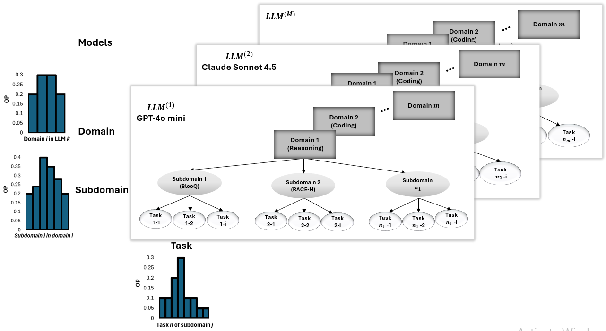
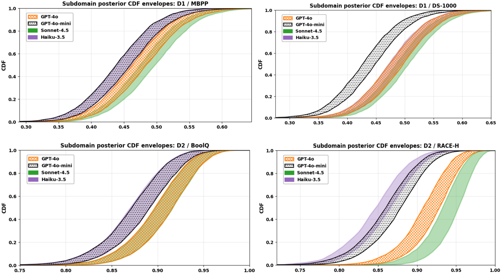
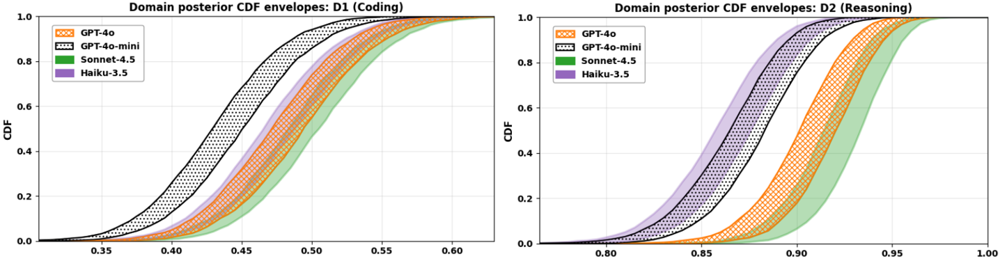
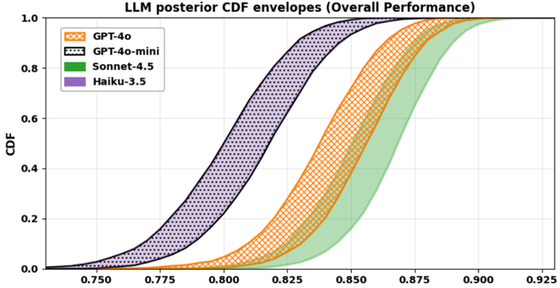
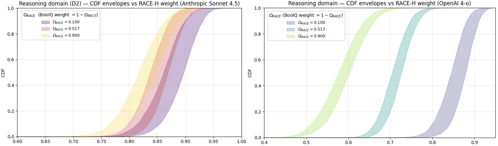
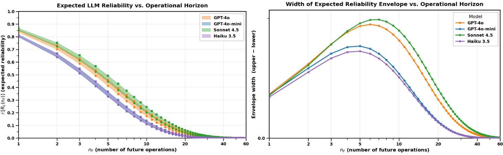
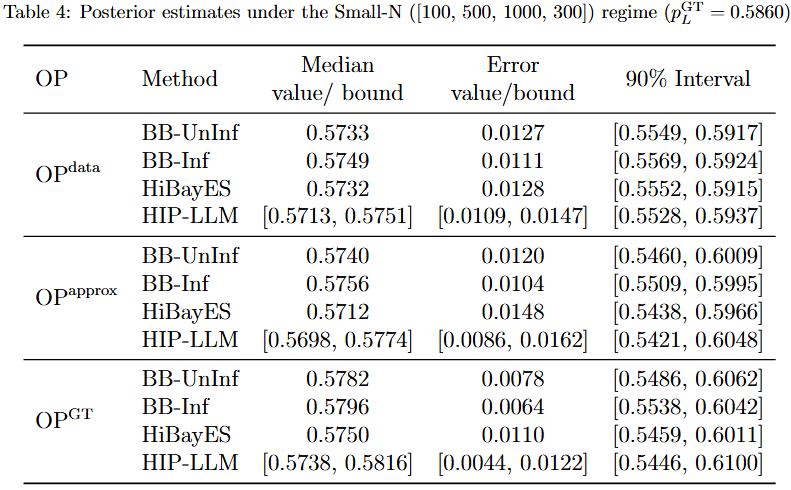
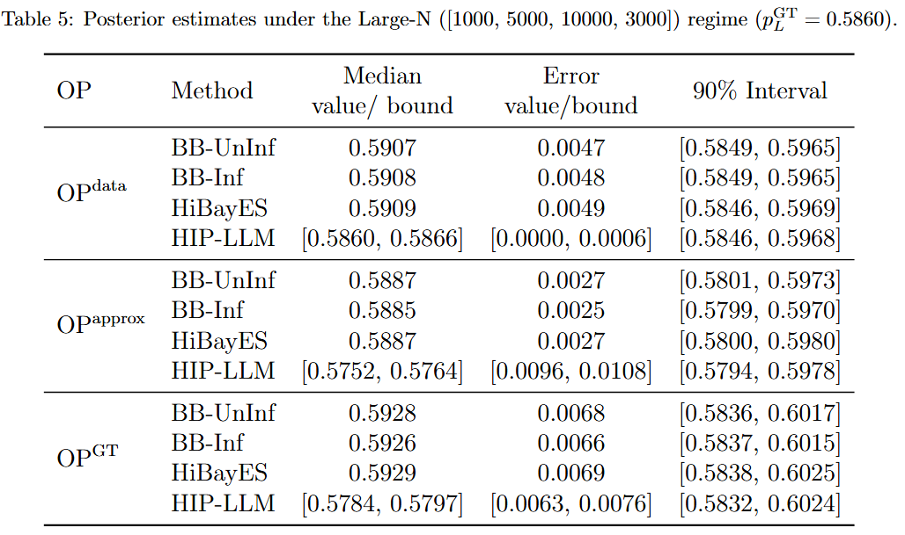

# HIP-LLM: A Hierarchical Imprecise Probability Approach to Reliability Assessment of Large Language Models

A tiny, reproducible bundle of **numerics** used in all figures of the paper (imprecise hierarchical Bayes over LLM accuracies).

📄 **Paper**: [arXiv](link-when-available) | [PDF](link-when-available)

---

## 📑 Table of Contents
- [Quick Start](#quick-start)
- [Authors](#-authors)
- [Overview](#-overview)
- [Abstract](#-abstract)
- [Visualizations](#-visualizations)

---

## Quick Start

Clone the repo and install the tiny runtime dependencies:

```bash
git clone https://github.com/aghazadehchakherlou-web/llm-imprecise-bayes.git
cd llm-imprecise-bayes
pip install -r requirements.txt
```

---

## 👥 Authors

- [Robab Aghazadeh Chakherlou](https://scholar.google.co.uk/citations?hl=en&user=hfn5eFMAAAAJ)
- [Qing Guo](https://scholar.google.co.uk/citations?hl=en&user=joK9NAoAAAAJ)
- [Siddartha Khastgir](https://scholar.google.co.uk/citations?hl=en&user=r3ldU6sAAAAJ)
- [Peter Popov](https://scholar.google.co.uk/citations?hl=en&user=ZraM0uwAAAAJ)
- [Xiaoge Zhang](https://scholar.google.co.uk/citations?hl=en&user=USCW004AAAAJ)
- [Xingyu Zhao](https://scholar.google.co.uk/citations?hl=en&user=SzEBdA8AAAAJ)

---

## 🌐 Overview

### General Structure:
This figure provides a high-level overview of HIP-LLM, with an emphasis on how the operational profile shapes the analysis. It shows how an LLM is broken into multiple domains, each made up of several subdomains. Subdomains within the same domain share information, while different domains remain independent. This layered structure supports reliability inference from subdomains up to the full LLM ( subdomain → domain → LLM).

<p align="center">
  
</p>

### Hierarchical Bayesian Model: This visualization corresponds to the detailed model. It illustrates the full bottom-up Bayesian inference flow.
This diagram illustrates the full hierarchical model used in HIP-LLM. It shows how subdomain results feed into domain-level parameters, which are then combined using operational profiles to estimate domain and system-level reliability. It highlights how uncertainty is represented and propagated through the hierarchy.
<p align="center">
 
</p>

---

## 📝 Abstract

Large Language Models (LLMs) are increasingly deployed across diverse domains, raising the need for rigorous reliability assessment methods. Existing benchmark-based evaluations primarily offer descriptive statistics of model accuracy over datasets, providing limited insight into the probabilistic behavior of LLMs under real operational conditions. This paper introduces HIP-LLM, a Hierarchical Imprecise Probability framework for modeling and inferring LLM reliability. Building upon the foundations of software reliability engineering, HIP-LLM defines LLM reliability as the probability of failure-free operation over a specified number of future tasks under a given Operational Profile (OP). HIP-LLM represents dependencies across (sub-)domains hierarchically, enabling multi-level inference from subdomain to system-level reliability. HIP-LLM embeds imprecise priors to capture epistemic uncertainty and incorporates OPs to reflect usage contexts. It derives posterior reliability envelopes that quantify uncertainty across priors and data. Experiments on multiple benchmark datasets demonstrate that HIP-LLM offers a more accurate and standardized reliability characterization than existing benchmark and state-of-the-art approaches. A publicly accessible repository of HIP-LLM is provided.

---

## 📊 Visualizations

### Subdomain Structure:
This figure focuses on the lowest layer of the hierarchy. Each subdomain contributes its own performance data, which forms the basis for estimating subdomain-level accuracy. These estimates serve as the starting point for all higher-level reliability analysis.
<p align="center">
  
</p>

### Domain Structure:
This figure shows how subdomain results within the same domain are combined. The model treats subdomains in a domain as related, so evidence from one subdomain influences others. The domain structure summarizes how these dependent subdomains contribute to an overall domain-level reliability estimate.
<p align="center">
  
</p>

### LLM-Level Reliability:
This visualization shows how domain-level results come together to produce the overall reliability of the LLM. Each domain contributes according to its operational importance. The figure highlights how uncertainty at lower levels accumulates into the system-level reliability envelope.
<p align="center">
  
</p>

### Operational Weights:
This figure shows the operational profiles used in the analysis. These weights reflect how frequently different subdomains and domains are expected to occur in real-world usage. They ensure that the final reliability estimate represents realistic operational conditions.
<p align="center">
  
</p>

### Hyperparameters:
This figure presents the ranges of prior assumptions used in the imprecise probability model. The hyperparameters capture uncertainty about domain behaviour before observing data, and varying them produces a family of posterior results that reflect epistemic uncertainty.
<p align="center">
  
</p>

### Reliability:
This figure summarizes the final reliability results of HIP-LLM. It shows how the LLM’s expected failure-free performance changes over future tasks, along with the uncertainty range arising from both data and prior assumptions. It provides a clear view of the LLM's reliability under realistic usage.
<p align="center">
  
</p>

### Comparison to baselines:
Tables 4 and 5 summarize how system-level reliability estimates vary with prior assumptions, operational profile (OP) specification, and sample size. In the Small-N regime (Table 4), all methods slightly underestimate the ground-truth reliability, and both OP mismatch and prior choice materially affect results: informative priors can reduce point error when correctly aligned, while dataset-based or approximated OPs increase bias. Unlike point-estimate baselines, HIP-LLM reports envelopes of plausible medians and credible intervals, explicitly capturing epistemic uncertainty due to prior and OP ambiguity. In the Large-N regime (Table 5), posterior estimates converge across all methods and OP scenarios, with narrow intervals indicating data dominance; correspondingly, HIP-LLM’s envelopes collapse to tight bounds, showing that prior uncertainty becomes negligible when sufficient evidence is available.
<p align="center">
  
</p>

<p align="center">
  
</p>

---

## 📦 Repository Structure

```
llm-imprecise-bayes/
├── README.md
├── requirements.txt
├── General_Structure.PNG
├── hierarchical_Bayes_imprecise_dependentSub_i.PNG
├── subdomain.PNG
├── domain.PNG
├── LLM.PNG
├── weight.PNG
├── hyperparameter.PNG
└── reliability.PNG
```

---

## 📄 Citation

If you use this work, please cite:

```bibtex
@article{aghazadeh2025hipllm,
  title={HIP-LLM: A Hierarchical Imprecise Probability Approach to Reliability Assessment of Large Language Models},
  author={Aghazadeh Chakherlou, Robab and Guo, Qing and Khastgir, Siddartha and Popov, Peter and Zhang, Xiaoge and Zhao, Xingyu},
  year={2025}
}
```

---

## 📧 Contact

For questions or collaborations, please reach out to the authors via their Google Scholar profiles listed above.
